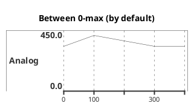

##### WSL config
https://learn.microsoft.com/pt-br/windows/wsl/tutorials/wsl-vscode

wsl --install -d Ubuntu-26.04 
wsl -d Ubuntu-26.04

##### docker
https://dev.to/poveda/wsl2-podman-uma-alternativa-ao-docker-desktop-5cd6 

##### Spec Compiler
https://github.com/SpecIR/SpecCompiler

##### HDL
https://www.mathworks.com/help/hdlcoder/index.html
https://www.mathworks.com/help/hdlcoder/gs/fpga-synthesis-and-analysis-using-the-hdl-workflow-advisor.html
https://au.mathworks.com/help/hdlcoder/ug/matlab-hdl-coder-workflow-advisor.html

##### plantUML

https://plantuml.com/timing-diagram

